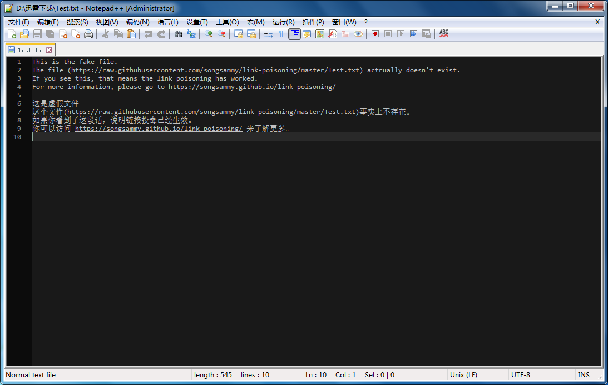

# link-poisoning
## Overview
An attempt to attack some p2p tools.   
Download demo:   

> [https://raw.githubusercontent.com/songsammy/link-poisoning/master/Test.txt ](https://raw.githubusercontent.com/songsammy/link-poisoning/master/Test.txt  "Test.txt")  
If you click the url from a web browser, then you will get a 404.
However, if you download it with a p2p tool, then you will get a fake file.
As this is just a test, there's no virus in the file(just a txt file).
however, it proved that the attack is possible.

Affected software:   
|Icon|Name|
|---|---
||Thunder|

Test:   
>Author: * <Email name protected> 2019-06-03 23:07:05   
>Committer: * <Email name protected> 2019-06-03 23:07:05   
>Precedes:    
>	
>    Test begin!

Result:   

